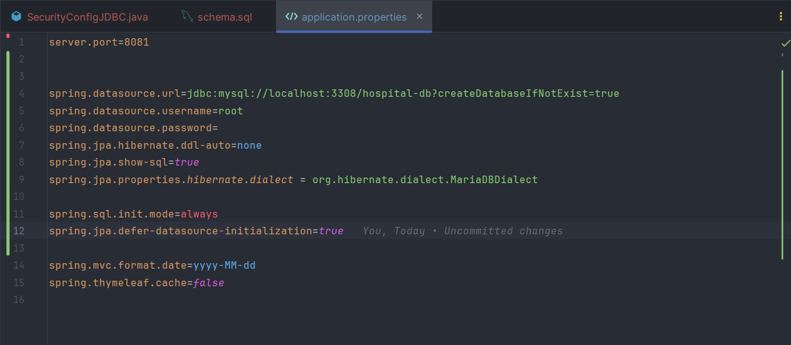

<h1>
Hospital App (Spring Security)</h1>
<hr>
<br>

In this project I'm going to put the light on Spring Security types : <br>
<h6>1) InMemoryAuthentication</h6>
<h6>2) JDBC Authentication</h6>
<h6>3) UserDetailsService Authentication</h6>

<hr>

## **_1) InMemoryAuthentication_**

Once we start the application we get this login page :

<h4>1- Login page</h4>

<br>

To configure the application to use inMemoryAuthentication security, first we need to add SecurityConfig class that implement 2 methods :<br>
<br>
inMemoryUserDetailsManager method, to create new users and define their username, password and roles if it's a simple "USER" or "ADMIN" or both

The second method is securityFilterChain to configure the login page and associate each role with the request we want, also to permit http requests if it's authenticated and finally handling the access denied page


<h4>SecurityConfig.java</h4>

<br>
<br>
So to configure the path of login and notAuthorized pages, we should a controller class to handle paths as the following :
<h4>SecurityController.java</h4>

<br>
<br>

To customize the Login and notAuthorized page, we can make through thymeleaf enigne  or js framework such as Angular or ReactJs ...
<h4>Login.html</h4>

<br>
<h4>notAuthorized page</h4>

<br>
<h4>notAuthorized.html</h4>

<br>
<hr>

## **_1) JDBC Authentication_**

To configure the application to use JDBC Authentication security, first we need to add SecurityConfig class that implement 2 methods : 
<br>
<br>
First we need to create new JdbcUserDetailsManager that takes dataSource as parameter.<br>
The dataSource needed from our **_application.properties_**
```markdown
spring.datasource.url=jdbc:mysql://localhost:3308/hospital-db?createDatabaseIfNotExist=true
spring.datasource.username=root
spring.datasource.password=
```
<br>
The Second method it's the same SecurityFilterChain from SecurityConfigInMemory.java Class
<br>
<br>

<h4>SecurityConfigJDBC.java</h4>

<br>
<br>

Our application.properties file that handles the datasource url, username and password it also handles jpa hibernate ddl-auto as none so spring won't generate tables again and that helps with sql init mode which mean the application will always initialize our schema.sql file once starting the application, but if we choose our hibernate ddl-auto as update it will ignore our schema.sql
<h4>application.properties</h4>


<br>
<br>

Now in order to create users and authorities in our database we should create a schema.sql file in our resources package as the following

<h4>schema.sql</h4>


<br>
<br>

The question now is, where to get these sql requests from ?<br>
First we need to go to External Libraries > Maven: org.springframework.security:spring-security-core:6.0.2 > spring-security-core:6.0.2.jar > org.springframework.security > core > userDetails > jdbc > users.ddl


<br>
<br>

Now, the last thing is to create users and define roles.<br>

To do this, I had to create a CommandLineRunner Bean and inject JdbcUserDetailsManager into it and then create the users in condition that these users are not null 
<h4></h4>


<br>
<br>
So to configure the path of login and notAuthorized pages, we should a controller class to handle paths as the following :
<h4>SecurityController.java</h4>

<br>
<br>

To customize the Login and notAuthorized page, we can make through thymeleaf enigne  or js framework such as Angular or ReactJs ...
<h4>Login.html</h4>

<br>
<h4>notAuthorized page</h4>

<br>
<h4>notAuthorized.html</h4>

<br>
<br>
Once we start the application we get this login page :

<h4>1- Login page</h4>

<br>
<br>
<hr>
<<<<<<< HEAD

## **_3) UserDetailsService Authentication_**

<br>
To configure the application to use UserDetailsService Authentication security, first we need to add sub-packages of entities, repositories and services : 


<br>

<h4>Packages & Classes</h4>


<br>
<br>

For AppUser entity, we are going to implement it's class and repository as the following :

<h4>AppUser.java</h4>


<br>

<h4>AppUserRepository.java</h4>


<br>
<br>

For AppRole entity, we are going to implement it's class and repository as the following :


<h4>AppRole.java</h4>


<br>

<h4>AppRoleRepository.java</h4>


<br>
<br>
<br>

For the services needed we are going to do the following :<br>
**1st** method is addNewUser is to create a new user defined by (***username***, ***password***, ***email***, ***confirmPassword***)<br>
**2nd** method is addNewRole is to create a new role defined by (***role***)<br>
**3rd** method is addRoleToUser is to define roles of each user (***username***, ***role***)<br>
**4th** method is removeRoleFromUser is to remove any role from any user (***username***, ***role***)<br>
**5th** method is loadUserByUsername is to load a user created before from the database using its username (***username***)<br>

<h4>AccountService.java</h4>


<br>
<br>
The implementation of these services :

```java
@Service
@Transactional
@AllArgsConstructor
public class AccountServiceImpl implements AccountService {

    private AppUserRepository appUserRepository;
    private AppRoleRepository appRoleRepository;
    private PasswordEncoder passwordEncoder;

    @Override
    public AppUser addNewUser(String username, String password, String email, String confirmPassword) {
        AppUser user = appUserRepository.findByUsername(username);
        if (user!=null) throw new RuntimeException("User already exist");
        if (!password.equals(confirmPassword)) throw new RuntimeException("Wrong Password");
        user = AppUser.builder()
                .userId(UUID.randomUUID().toString())
                .username(username)
                .email(email)
                .password(passwordEncoder.encode(password))
                .build();
        AppUser savedUser = appUserRepository.save(user);
        return savedUser;
    }

    @Override
    public AppRole addNewRole(String role) {
        AppRole appRole = appRoleRepository.findById(role).orElse(null);
        if (appRole!=null) throw new RuntimeException("Role already exists");
        appRole = AppRole.builder()
                .role(role)
                .build();
        AppRole savedRole = appRoleRepository.save(appRole);
        return savedRole;
    }

    @Override
    public void addRoleToUser(String username, String role) {
        AppUser appUser = appUserRepository.findByUsername(username);
        if (appUser==null) throw new RuntimeException("User doesn't exist");
        AppRole appRole = appRoleRepository.findById(role).get();
        appUser.getRoles().add(appRole);
    }

    @Override
    public void removeRoleFromUser(String username, String role) {
        AppUser appUser = appUserRepository.findByUsername(username);
        if (appUser==null) throw new RuntimeException("User doesn't exist");
        AppRole appRole = appRoleRepository.findById(role).get();
        appUser.getRoles().remove(appRole);
    }

    @Override
    public AppUser loadUserByUsername(String username) {
        return appUserRepository.findByUsername(username);
    }
}

```
<br>
<br><br>

In this Class we implement loadUserByUsername from UserDetailsService to create a userDetails of type UserDetails and assert usernames, passwords and authorities of our AppUser entity into the userDetails

<h4>UserDetailsServiceImpl.java</h4>


<br>
<br><br>

In the Security Config Class we use the passwordEncoder and SecurityFilterChain as the other security-types above.<br>
The only difference is injecting userDetailsServiceImpl of type UserDetailsServiceImpl and use it in our SecurityFilterChain

<h4>SecurityConfigUser.java</h4>


<br>
<br><br>

Now let's define each endpoint with it's suitable authority

<h4>PatientController.java</h4>


<br>
<br><br>

Let's test our services :

<h4>CommandLineRunnerUserDetails</h4>


<br>
<br>

For this part we create an endpoint of profile which contains the informations about the profile logged in, username, authorities ...

<h4>SecurityRestController.java</h4>


<br>
<br>

And finally let's add an error message for each wrong login attempt :

<h4>login.html</h4>


<br>
<br>
